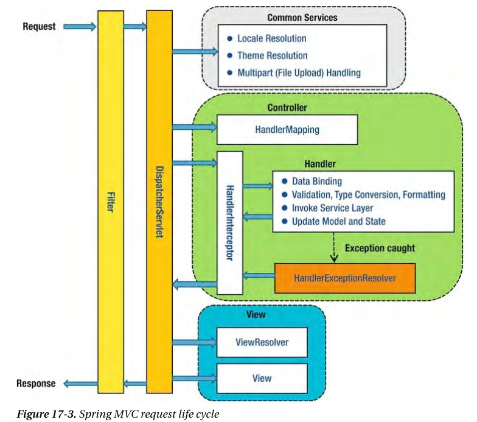

Controller에 Request가 도달하기 전/후 그리고 Controller가 수행을 완료 후에 처리를 할 수 있는 HandlerInterceptor가 있다.

아래와 같이 사용하면 된다.

```java
public class InterceptorClass implements HandlerInterceptor {

    @Override
    public boolean preHandle(HttpServletRequest request, HttpServletResponse response, Object handler) throws Exception{
        /* 원하는 처리 */
    }
}

// ----------------------------- //

/* Interceptor 등록을 위한 Configuration */

@Configuration
public class WebMvcConfig implements WebMvcConfigurer {
    
    @Override
    public void addInterceptors(InterceptorRegistry registry){
        registry.addInterceptor(new InterceptorClass())
                .addPathPatterns("...");
    }
}
```


