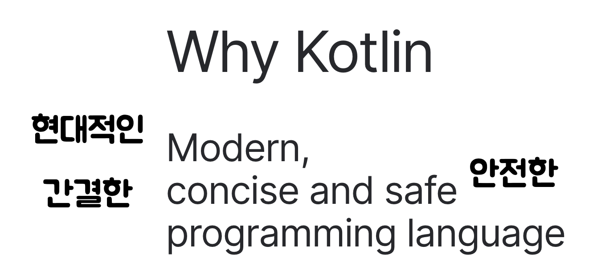

_(본 내용은 해당 강의를 보고 공부를 위해 요약한 자료입니다. 출처 : https://www.inflearn.com/course/java-to-kotlin/dashboard)_

# 코틀린에 관한 34가지 TMI
1. 코틀린이라는 프로그래밍 언어는 IntelliJ를 만든 JetBrains라는 회사에서 만들었다.
2. IntelliJ는 Java 및 Kotlin을 이용한 프로젝트에서 널리 사용되는 IDE 이다.
3. JetBrains는 체코의 회사이다.
4. JetBrains는 IntelliJ 외에도 PyCharm, WebStorm 등 python, JS를 위한 IDE도 만들고 있으며 많이 사용되는 추세이다.
5. Kotlin이라는 이름은 코틀린 섬에서 따왔는데 이는 JetBrains의 R&D 센터가 상트페테르부르크에 있기 떄문이다.
6. Kotlin이 구동되는 JVM의 대표언어 Java가 인도네시아 Java섬에서 이름을 따왔음을 감안해보면 섬 이름을 타겟으로 하는 언어임이 분명하다.
7. 코틀린 섬은 원래 스웨덴령이었지만, 1703년 포트르 대제가 빼앗아 현재까지 러시아의 섬이 되었다.
8. 코틀린은 2020년 stack over flow에서 조사한 '개발자들이 가장 사랑하는 언어' 4위에 랭크된 적이 있다.
9. 같은해 조사된, 배우고 싶은 언어에는 6위에 랭크되었다.
10. 2021년 12월 프로그래머스에서 조사한 설문결과에서 코틀린은 가장 배우고 싶은 언어 1위를 차지하였다.
11. 코틀린은 Java와 100% 호환 가능하면서도 현대적이고, 간결하며 안전한 언어를 사용하기 위해 탄생되었다. JetBrains에서 만드는 IntelliJ가 Java로 작성되어 있는데, 유지보수하다가 화가 났다고 한다.
12. 코틀린 언어 공식 홈페이지에서 코틀린의 철학을 알 수 있다.

13. 코틀린은 Java와 100% 호환 가능하기 때문에 JVM 위에서 동작한다.
14. JVM 위에서 동작하는 언어에는 Java와 Kotlin 말고도 Scala, Groovy등이 있다.
15. 코틀린은 멀티 플랫폼 언어로 Android 앱개발 / IOS 앱개발 / 서버개발 / 웹개발 / 임베디드와 IoT / 데스크톱까지 다양한 플랫폼과 Data Science 까지 사용되는 것을 목표로 하고 있다.
16. 하지만 현재까지 가장 많이 사용되는 곳은 Android 앱 개발과 서버 개발이다.
17. Android의 개발사인 구글은 2017년 안드로이드 공식엉어로 코틀린을 추가했드며, 2019년 부터는 Kotlin First를 외치며 공식 문서 샘플 코드를 Java 에서 Kotlin으로 변경했다.
18. 이떄부터 구글에서 작성하는 Android 프로젝트는 코틀린으로 작성되었다.
19. 코틀린은 정적 타입 언어이다. 프로그램 구성요소의 타입을 컴파일 시점에 알 수 있고, 프로그램 안에서 필드나 메소드를 사용할 때 컴파일러가 타입을 검증해준다는 뜻.
20. 코틀린은 객체지향형 프로그래밍(OOP)와 함수형 프로그래밍(FP)를 조화롭게 지원한다.
21. 코틀린은 무료 오픈소스로 아파치 2.0 라이센스를 가지고 있다.
22. 아파치 2.0 라이센스는 소스코드 공개 의무가 존재하지 않으며, 상업적 이용에 제한을 두고 있지 않다. 다시 말해, 코틀린을 사용해 만들어진 프로그램은 소스코드를 공개하지 않고 상업적 이용을 해도 된다는 의미다.
23. 코틀린 언어 개발자들은 코틀린 언어의 간결함을 살리기 위해 프로그래머가 작성하는 코드에서 의미 없는 부분은 줄이고 언어가 요구하는 구조를 만족시키기 위해 별 뜻은 없지만 프로그램에 꼭 넣어야 하는 부수적인 요소를 줄이기 위해 많은 노력을 하였다.
24. Kotlin의 파일 확장자는 .kt이다.
25. Kotlin에서는 Java와 달리 세미콜론을 붙이지 않아도 된다.
26. Kotlin에서 주석을 처리하는 방법은 Java와 동일하다.
27. Kotlin에는 Java와 동일하게 패키지라는 개념이 있다.
28. Kotlin에서는 별도 지시어를 붙이지 않으면 모두 Public이다.
29. Kotlin에서는 출력을 할 때에 `System.out.println()` 대신 println()만 작성하면 된다.
30. Kotlin에서는 함수를 작성할 때 fun 이라는 키워드를 사용한다. fun 이라는 단어는 재미있는 이라는 뜻도 가지고 있어 가끔 fun fun(재미있는 함수)라는 외국 드립이 보일 때도 있다.
31. Java에서는 '타입 변수명'을 사용했지만, 코틀린에서는 TS와 유사하게 '변수명: 타입'을 사용한다.
32. Kotlin의 Hello World는 다음과 같다.
```kotlin
fun main() {
    println("Hello World")
}
```
33. Kotlin에서는 변수나 함수 클래스 모두 파일 최상단에 선언할 수 있다.
34. Java를 알고 있는데 Kotlin을 쉽고 빠르게 배우고 싶으신 분들을 위한 강의가 인프런에 존재한다.


