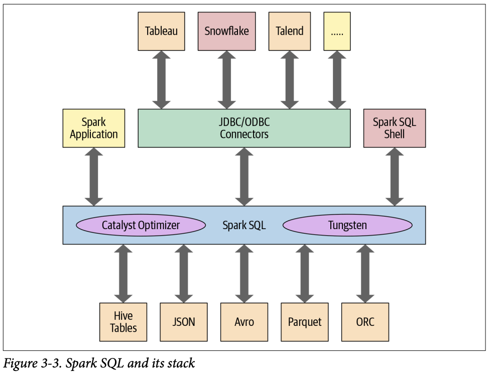

_(본 내용은 **러닝 스파크** 도서를 읽고 요약한 내용입니다.)_


# Chapter 3. 아파치 스파크의 정형화 API
- 이 장에서는 아파치 스파크에 정형화된 구조를 추가하게 된 주된 동기와 그 동기가 어떻게 상위 수준 API 개발로 이어졌는지 확인.

## 스파크: RDD의 아래에는 무엇이 있는가
- RDD(Resilient Distributed Dataset) : 스파크의 기본 데이터 구조
- 세 가지 핵심 특성
  - 의존성 : 어떤 입력을 필요로 하고 현재의 RDD가 어떻게 만들어 지는지 스파크에게 가르쳐주는것
  - 파티션 : 스파크에게 작업을 나눠서 이그제큐터들에 분산해 파티션별로 병렬 연산 할 수 있는 능력을 부여.
  - 연산함수 (Partition => Iterator[T]) 

## 스파크의 구조 확립
- 스파크 구조 확립을 위한 핵심 개념들을 도입
  - 연산들을 일상적인 패턴을 통해 표현하여 알기쉽게 만듬
  - 상위수준 DSL과 연산자 API를 사용

### 이러한 스파크 구조의 핵심적인 장점과 이득
```python
dataRDD = sc.paralleilize(["Brooke", 20), ("Denny", 31), ("Jules", 30), ("TD", 35), ("Brooke", 25)])
agesRDD = (dataRDD.map(lambda x: (x[0], (x[1], 1))))
                .reduceByKey(lambda x, y: (x[0] + y[0], x[1] + y[1]))
                .map(lambda x : (x[0], x[1][0]/x[1][1]))

```
- 위 코드가 아래처럼 알기쉽게 바뀜(고수준 DSL연산자들과 데이터 프레임 API를 써서)
```python
spark = (SparkSession.builder.appName("AuthorsAges").getOrCreate())
data_df = spark.createDataFrame(["Brooke", 20), ("Denny", 31), ("Jules", 30), ("TD", 35), ("Brooke", 25)], ["name", "age"])
avg_df = data_df.groupBy("name").agg(avg("age"))
avg_df.show()
```
- 이러면 스파크 입장에서는 효과적인 실행을 위해 연산을 최적화하고 재배열 할 수 있다.
- 이런것들의 장점은 언어가 바뀌어도 형태가 비슷해 일관성을 갖게 해준다.

## 데이터 프레임 API
### 스키마와 데이터 프레임 만들기
- 스파크에서 스키마는 데이터 프레임을 위해 칼럼 이름과 연관된 데이터 타입을 정의한것이다.
- 스키마를 정의하는 것은 세가지 장점이 있다.
  - 스파크가 데이터 타입을 추측해야 하는 책임을 덜어 준다.
  - 스파크가 스키마를 확정하기 위해 파일의 많은 부분을 읽어 들이려고 별도의 잡을 만드는 것을 방지한다.
  - 데이터가 스키마와 맞지 않는 경우, 조기에 문제를 발견할 수 있다.

### 스키마를 정의하는 법
```scala
val schema = StructType(Array(StructField("author", StringType, false),
StructField("title", StringType, false), 
StructField("pages", IntegerType, false)))

val schema = "author STRING, title STRING, pages INT"
```

- 로우
  - 하나 이상의 칼럼을 갖고 있는 것
```
Row("Matei Zaharia", "CA")
```

- 자주 쓰는 데이터 프레임 작업들
  - 데이터 프레임에서 일반적인 데이터 작업을 수행하려면 우선 구조하된 데이터를 갖고 있는 데이터 소스에서 데이터 프레임으로 로드를 해야한다.
  - 스파크는 이를 위해 `DataFrameReader`라는 이름의 인터페이스를 제공하여 이는 JSON, CSV, 파케이, 텍스트, 에이브로, ORC 같은 다양한 포맷의 데이터 소스에서 데이터를 읽어 데이터 프레임으로 갖고 오게 해준다.
  - 동일하게 특정 포맷의 데이터소스에 데이터 프레임의 데이터를 써서 내보내기 위해서는 `DataFrameWriter`를 쓴다.

- 스키마 지정을 안해줄수도 있다.
```scala
val sampleDF = spark
              .read
              .option("samplingRatio", 0.001)
              .option("header", true)
              .csv("""/~~~/fire-calls.csv""")
```

### DataFrameReader와 DataFrameWriter 사용하기
- `spark.read.csv()` 함수는 CSV 파일을 읽어서 row 객체와 스키마에 맞는 타입의 이름 있는 칼럼들로 이루어진 데이터 프레임을 되돌려 준다.
- 데이터 프레임을 외부 데이터 소스에 원하는 포맷으로 쓰려면 `DataFrameWriter` 인터페이스를 사용할 수 있다.

#### 데이터 프레임을 파케이 파일이나 SQL 테이블로 저장하기
- 일반적으로 많이 하는 데이터 작업으로, 데이터를 탐색하고 변환한 후 파케이 포맷이나 SQL 테이블로 데이터를 저장하는 것이다. 
```scala
// 파케이로 저장
val parquetPath = ...
fireDF.write.format("parquet").save(parquetPath)

// 테이블로 저장
val parquetTable = ...
fireDF.write.format("parquet".saveASTAable(parquetTable))
```

#### 트랜스포메이션과 액션
- 메모리에 호출 데이터로 구성된 분산 데이터 프레임을 갖고 있으므로, 칼럼이 어떻게 구성되어 있는지 살펴봐야 한다. (타입, null 체크...)
- 프로젝션과 필터
  - 프로젝션 : 관계형 DB식으로 말하면 필터를 이용해 틀정 관계 상태와 매치되는 행들만 되돌려 주는 방법.
  - 스파크에서는 프로젝션은 select() 메서드로 수행하는 반면, 필터는 filter()나 where() 에서드로 표현된다.
- 컬럼의 이름변경 및 추가 삭제
  - 컬럼의 이름변경
    - StructField를 써서 스키마 내에서 원하는 컬럼 이름들을 지정하면 된다.
    - `withColumnRenamed()` 함수를 사용한다.
  - 컬럼의 추가 삭제
    - 타입을 변경해서 새로운 컬럼으로 사용하고 싶을떄
```scala 
val fireTsDF = newFireDF
    .withColumn("IncidentDate", to_timestamp(col("CallDate"), "MM/dd/yyyy"))
    .drop("callDate")
    .withColumn("OnwatchDate", to_timestamp(col("WatchDate"), "MM/dd/yyyy"))
    .drop("WatchDate")

// 변환된 컬럼을 가져온다.
fireTsDF
.select("IncidentDate", "OnwatchDate") 
.show(5, false)
```
  - 요렇게 바꾸면 `spark.sql.functions`에서 `dayofmonth(), dayofyear(), dayofweek()` 같은 함수들을 써서 질의할 수 있다.

- 집계연산
  - `groupBy(), orderBy(), count()` 와 같이 데이터 프레임에서 쓰는 일부 트랜스포메이션과 액션은 컬럼 이름으로 집계해서 각각 개수를 세어주는 기능을 제공한다.

> 데이터 프레임 API는 collect() 함수를 제공하지만 극단적으로 큰 데이터 프레임에서는 OOM을 발생시킬 수 있기 떄문에 자원도 많이 쓰고 위험하다.

- 그 외 일반적인 데이터 프레임 연산들
  - `min(), max(), sum(), avg()...`
  - `stat(), describe(), correlation(), covariance(), sampleBy(), approxQuantile(), frequentItems()`

## 데이터세트 API
- 정적 타입 / 동적 타입 두 특성을 모두 가진다.
- Row는 스파크의 포괄적 객체 타입이며 다양한 타입의 값들을 담을 수 있다.
```scala
val row = Row(350, true, "Learning Spark 2E", null)
```
### 데이터 세트 생성
- 데이터 세트를 반들 때에도 해당 스키마를 알아야 한다. 
- 다시 말하면 데이터 타입들을 모두 알고 있어야 한다.
- JSON이나 CSV 데이터라면 스키마 추론이 가능하겠지만 대용량 데이터에서는 이런 작업은 무겁다.
- 스칼라에서 스키마를 가장 쉽게 지정하는 방법은 **케이스 클래스** 사용이다.

#### 케이스 틀래스
```json
{
  "device_id": 198164, 
  "device_name": "sensor-pad-...",
  "ip": "80.55.20.25",
}
```
```scala
case class DeviceIoTData (device_id: Long, device_name: String, ip: String)
```
- 케이스 클래스를 정의한 이후에는 파일을 읽어서 Dataset[Row]를 Dataset[DeviceIoTData]로 바꾸는 데에 사용 가능
```scala
val ds = spark.read
          .json("/databricks-daatasets/.../iot_devices.json")
          .as[DeviceIoTData]
        
ds: Dataset[DeviceIoTData] = [battery_level...]

ds.show(5, false)
```

### 데이터 세트에서 가능한 작업들
- 데이터 프레임에서 트랜스포메이션이나 액션들을 수행했던 것처럼, 데이터세트에서도 그런 것들이 가능하다.
```scala
val filterTempDS = ds.filter(d => d.temp > 30 && d.humidity > 70)
filterTempDS: Dataset[DeviceIoTData] = [battery_level...]
filterTempDS.show(5, false)
```

## 데이터 프레임 VS 데이터세트
- '왜', '언제' 데이터 프레임이나 데이터 세트를 쓰는걸까?
- 많은 경우 어느 쪽이든 사용하는 언어에 따라 둘 중 하나가 쓰이게 되거나 선호되는 경우가 있다.
- 이런 경우들
  - 스파크에게 **어떻게 하는지**가 아니라 **무엇을 해야 하는지** 말하고 싶으면 데이터 프레임이나 데이터 세트를 사용한다.
  - 풍부한 표현과 높은 수준의 추상화 및 DSL 연산을 원할떄
  - 컴파을 타음에 엄격한 타입 체크를 원하며 특정한 Dataset[T]를 위해 여러 개의 케이스 클래스를 만드는 것에 부담이 없을때
  - 자신의 작업이 높은 수준의 표현력, 필터, 맵, 집계, 평균과 합계 계산, SQL, 컬럼 지향 접근, 반정형화된 데이터에 대한 관계형 연산 등이 필요할때
  - 작업이 SQL과 유사한 질의를 쓰는 관계형 변환을 필요로 할 때.
  - 인코더를 써서 프로젝트 텅스텐의 직렬화 능력을 통한 이득을 보고 시픙ㄹ때
  - 일원화, 코드 최적화, 스파크 컴포넌트들 사이에서의 API 단순화를 원할때
  - R 사용자일떄 데이터 프레임을 쓴다.
  - 공간/속도의 효율성을 원할때 데이터 프레임을 쓴다.
  - 실행 시에 발생하는 에러를 찾기보다 컴파일 시에 발생하는 에러를 찾고 싶을때

### 언제 RDD를 사용하는가
- RDD는 데이터 프레임/세트 덕에(?) 이류로 전략한 것일까?
  - 아니다
- RDD 사용을 고려해보아야 할 시나리오
  - RDD를 사용하도록 작성된 서드파티 패키지
  - 데이터 프레임/세트에서 얻을 수 있는 코드 최적화, 효과적인 공간 사용, 퍼포먼스의 이득을 포기할 수 있다.
  - 스파크가 어떻게 질의를 수행할지 정확하게 지정해 주고 싶을때
- 데이터 세트/프레임에서 RDD로 가기 위해서는 단순한 API함수인 df.rdd만 호출
  - 결국 데이터 프레임/세트는 RDD에 기반해서 만들어 졌음.

## 스파크 SQL과 하부의 엔진
- 스파크 SQL 엔진이 하는일
  - 스파크 컴포넌트들을 통합하고 데이터 프레임/세트가 자바, 스칼라, 파이선 R 등으로 정형화 데이터 관련 작업을 단순화 할 수 있도록 추상화 해준다.
  - 아파치 하이브 메타스토어와 테이블에 접근한다.
  - 정형화된 파일 포맷에서 스키마와 정형화 데이터를 읽고 쓰며 데이터를 임시 테이블로 변환한다.
  - 빠른 데이터 탐색을 할 수 있도록 대화형 스파크 SQL 셸을 제공한다.
  - 표준 데이터페이스 JDBC/ODBC 커넥터를 통해 외부의 도구들과 연결할 수 있는 중간 역할을 한다.
  - 최종 실행을 위해 최적화된 질의 계획과 JVM을 위한 최적화된 코드를 생성한다.


- 스파크 SQL 엔진의 핵심에는 카탈리스트 옵티마이저와 텅스텐 프로젝트가 있다.

### 카탈리스트 옵티마이저
- 연산 쿼리를 받아 실행 계획으로 변환한다.
- 최적화 과정을 거친다.

1. 분석
2. 논리적 최적화
3. 물리 계획 수립
4. 코드 생성
  - 각 머신에서 실행할 효율적인 자바 바이트 코드를 생성
  - 스파크 SQL은 메모리에 올라와 있는 데이터 집합을 다루므로 스파크는 실행 속도를 높이기 위한 코드 생성을 위해 최신 컴파일러 기술을 사용할 수 있다.
  - 다시 말하면 스파크는 컴파일러 처럼 동작
  - 포괄 코드 생성을 가능하게 하는 프로젝트 텅스텐이 여기서 역할을 하게 된다.
    - 포괄 코드 생성 : 물리적 쿼리 최적화 단계로 전체 쿼리를 하나의 함수로 합치면서 가상 함수 호출이나 중간 데이터를 위한 CPU 레지스터 사용을 없앤다.
    - 이러한 전략은 **CPU 효율과 성능**을 극적으로 높였다.

## 요약
- 이 장에서는 정형화의 역사와 이점에 대해 둘러보며 정형와 API를 다루었다.
- 상위 수준의 데이터 프레임/세트 API가 하위 수준의 RDD API에 비해 훨씬 표현력이 높고 직관적이라는 것을 살펴보았다.
- 마지막으로는 스파크 SQL 엔진의 주 컴포넌트인 카탈리스트 옵티마이저와 프로젝트 텅스텐이 상위 수준의 정형화 API와 DSL 함수들을 어떻게 지원하는지 내부를 들여다 보았다.
- 스파크 지원 언어 중 어떤 것을 사용하든 스파크 쿼리는 논리/물리 게획 수립에서 최종 코드 생성까지 동일한 최적화 과정을 거치게 된다.

