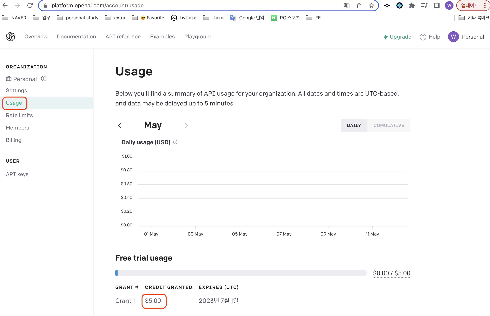
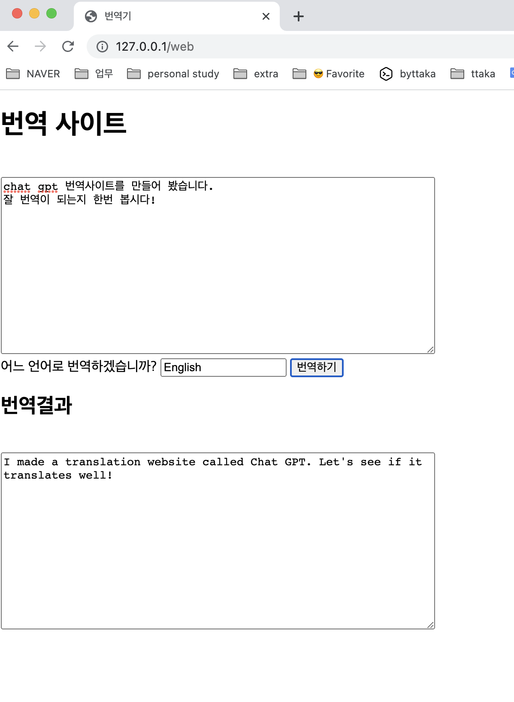
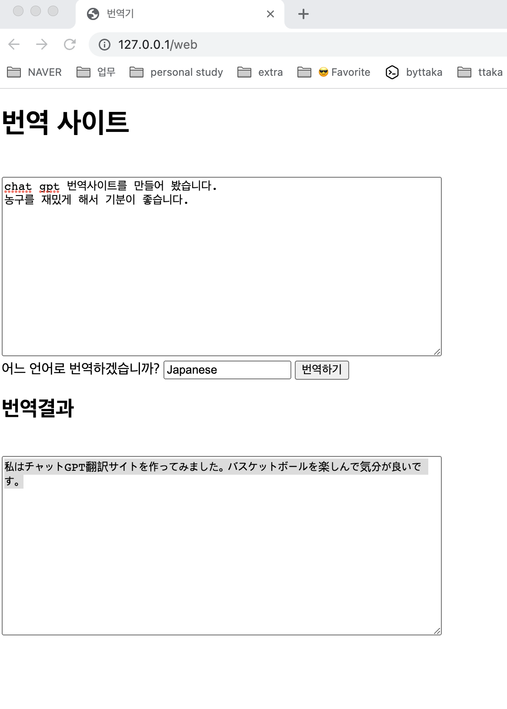

_(본 내용은 해당 강의를 보고 공부를 위해 요약한 자료입니다. 출처 : https://www.inflearn.com/course/chatgpt-%EB%8B%A4%EA%B5%AD%EC%96%B4-%EB%B2%88%EC%97%AD%EA%B8%B0-%EC%9B%B9%EA%B0%9C%EB%B0%9C)_


# ChatGPT api를 활용하는 방법을 python 코드로 알려줘
- [chatGPT에 물어본 사례](https://sharegpt.com/c/Voyxd7j)
  - ChatGPT는 2021년까지의 데이터를 학습했기에 openapi 라이브러리 변경사항이 반영되어 있지 않음.

# openAI api key 발급받기
- https://platform.openai.com/overview
1. 회원가입(or 로그인) 후 프로필 눌러 `View API Keys`로 들어감
2. `Create new secret key` 를 눌러 key를 확인
    - _딱 한번만 제공하니 잘 복사해 놓자_
3. `Usage` 들어가 무료 크래딧을 확인하자.
  
    - 1000 토큰에 0.002$가 사용됨.
    - 1달러에 약 50만 토큰
      - chatGPT 토큰 정책마다 다르다. 단어당 하나라고 보면 된다.
4. `Billing`에 들어가서 payment method를 등록하자.
  - 알람, 최대결제 한도 등을 설정할 수 있다.
  - _5달러가 결제가 되는데 몇일뒤 취소된다고 한다. 초반에는 환불이 됬었는데 환불이 안될수도 있어서 5달러 투자한다고 생각해야 마음이 편하다._ 
   - https://www.clien.net/service/board/kin/18005411

_(pycharm 설치 후 테스트)_
# API 사용해보기
```py
import openai

openai.api_key = "발급받은 키"

prompt = "Hello, How's weather in korea today"
response = openai.Completion.create(
    engine="text-davinci-002",
    prompt=prompt,
    max_tokens=60,
    n=1,
    stop=None,
    temperature=0.5,
)

message = response.choices[0].text.strip()
print(response)
```
- `import openai` 아래와 같은 오류 난다면 `pip install urllib3==1.26.6`
```cmd
ImportError: urllib3 v2.0 only supports OpenSSL 1.1.1+, currently the 'ssl' module is compiled with LibreSSL 2.8.3.
```

### 다른 모델 사용
``` py
response = openai.ChatCompletion.create(
    model="gpt-3.5-turbo", # <- 여기
    messages = [
        {
            "role": "user",
            "content": "how ar you today?"
        }
    ],
    max_tokens=50,
)
```
- 답변 
  - `"content": "As an AI language model, I do not have emotions or feelings, but thank you for asking! How can I assist you today?"`


### chatGPT 역할을 지정할 수 있다.
- role : system
```py
response = openai.ChatCompletion.create(
    model="gpt-3.5-turbo",
    messages = [
        {
          "role": "system", # <- 여기
          "content": "you are my friend." # <- 여기
        },
        {
            "role": "user",
            "content": "how ar you today?"
        }
    ],
    max_tokens=50,
)
```
- 답변
  - `"content": "As an AI language model, I do not have emotions like humans do, but I am functioning properly. How can I assist you today?"`


### chatGPT 대답을 늘려보자
- n : 5
```py
response = openai.ChatCompletion.create(
    model="gpt-3.5-turbo",
    messages = [
        {
          "role": "system",
          "content": "you are my friend."
        },
        {
            "role": "user",
            "content": "how ar you today?"
        }
    ],
    n=5, # <- 여기
    max_tokens=50,
)
```
- 답변이 5가지 버전으로 나온다.

### chatGPT 대답을 다양하게 만들어 보자
- temperature
  - 0 ~ 2 사이의 값
  - 1이 default 값임
  - 높은 값일 수록 더 다양한 대답을 한다.
  - 설명글일때(정확한 답변을 원할때)는 낮게 설정

```py
response = openai.ChatCompletion.create(
    model="gpt-3.5-turbo",
    messages = [
        {
          "role": "system",
          "content": "you are my friend."
        },
        {
            "role": "user",
            "content": "how ar you today?"
        }
    ],
    n=1,
    temperature=2, # <- 여기
    max_tokens=50,
)
```

### chatGPT를 번역기로 역할을 지정해주자
```py
response = openai.ChatCompletion.create(
    model="gpt-3.5-turbo",
    messages = [
        {
          "role": "system",
          "content": "you are a translater." # 번역기로 역할을 지정해줌
        },
        {
            "role": "user",
            "content": "안녕하세요. 나는 운동을 좋아하고 현재 GPT를 사용한 번역기를 만들어 보고 싶습니다. 이 문장을 영어로 번역해 주세요" # 나의 질문
        }
    ],
    n=1,
    temperature=0, # 정확한 답변을 기대.
    max_tokens=50,
)
```
- 답변 
  - `"content": "Hello. I like exercising and currently I want to create a translator using GPT. Please translate this sentence into English."`

# Flask를 이용해 다국어 번역기 server 만들기
- Flask 설치
```
pip install flask
```

### [server] 위에서 openai를 이용하는 코드와 Flask코드를 합치기
```py
import openai
from flask import Flask, request
openai.api_key = "발급받은 키"

app = Flask(__name__)

@app.route("/translater", method=["post"])
def translater():
    data = request.json

    language = data["language"]
    text = data["text"]

    prompt = f"{text}\n\nTranslate the sentence into {language}"

    response = openai.ChatCompletion.create(
        model="gpt-3.5-turbo",
        messages=[
            {
                "role": "system",
                "content": "you are a translater."
            },
            {
                "role": "user",
                "content": prompt
            }
        ],
        max_tokens=500,
    )


    return response["choices"][0]["message"]["content"]

# cors를 피하기위해 서버에서 html 띄움
@app.route("/web")
def web():
    return render_template("index.html")

@app.route("/")
def index():
        return "Hello world"


app.run(host="0.0.0.0", port=80)
```

### [Front] html 소스
```html
<!DOCTYPE html>
<html lang="en">
    <head>
        <meta charset="UTF-8">
        <title>번역기</title>
    </head>
    <body>
        <h1>번역 사이트</h1> <br />
    <textarea id="text" style="width: 500px; height: 200px;"></textarea> <br />

    어느 언어로 번역하겠습니까?
    <input id="language" type="text"/>
    <button id="button">번역하기</button><br/>

    <h2>번역결과</h2> <br />
    <textarea id="result" style="width: 500px; height: 200px;"></textarea>

    <script>
        let textAreaTag = document.getElementById("text");
        let languageTag = document.getElementById("language");
        let buttonTag = document.getElementById("button");
        let resultTag = document.getElementById("result");

        buttonTag.addEventListener("click", async () => {
            let text = textAreaTag.value;
            let language = languageTag.value;
            await fetch("http://127.0.0.1/translater", {
                "method": "post",
                "headers": {
                    "Content-Type": "application/json"
                },
                body: JSON.stringify({text, language})
            })
            .then((response) => response.text())
            .then((data) => {
                resultTag.value = data;
            })
        })
    </script>
    </body>
</html>
```

# 결과
### 영어


### 일본어
